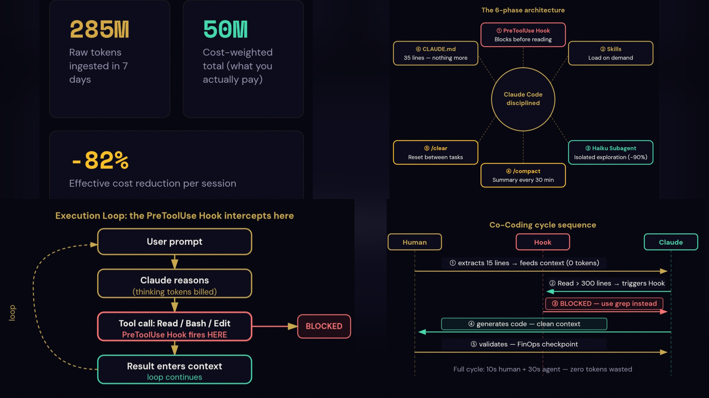

# Claude Code — Token Self-Optimization Prompt

> **Usage :** Paste this prompt directly into a Claude Code session.
> Claude will run the audit and optimization autonomously, phase by phase.
> **Series :** Companion to [claude-code-best-practice-playbook](https://github.com/papasega/claude-code-best-practice-playbook) — full setup & workflow reference.

> **Version :** Claude Code ≥ 2.1 · Last verified: 2026-09-13 · Verify with `claude --version`

---



## Context & Objective

You are tasked with performing a comprehensive self-optimization of this Claude Code environment to **minimize startup context cost and per-turn token waste** while measuring and minimizing regressions in task completion quality. This is a systematic audit-and-refactor mission.

Work through each phase below **in order**. Create all files. Report token estimates at each step. Do not ask for confirmation between phases — execute autonomously.

> **On the numbers in this document.** Token and cost figures are estimates from
> character counts and published per-token prices, not measurements of your workload.
> This prompt ships **no evaluation harness**, so quality neutrality is *not*
> demonstrated: treat every reduction as a hypothesis to validate on your own
> representative tasks before adopting it broadly.

---

## PHASE 1 — AUDIT (measure before optimizing)

Run the following diagnostics and report results:

```bash
# 1a. Estimate current CLAUDE.md token cost
echo "=== Global CLAUDE.md ===" && wc -l ~/.claude/CLAUDE.md 2>/dev/null || echo "No global CLAUDE.md"
echo "=== Project CLAUDE.md ===" && wc -l .claude/CLAUDE.md 2>/dev/null || echo "No project CLAUDE.md"

# 1b. Count all @imported files referenced in CLAUDE.md
grep -h "@" ~/.claude/CLAUDE.md .claude/CLAUDE.md 2>/dev/null | grep -v "^#" | grep -v "<!--"

# 1c. List all skills loaded at startup
echo "=== User skills ===" && ls ~/.claude/skills/ 2>/dev/null || echo "none"
echo "=== Project skills ===" && ls .claude/skills/ 2>/dev/null || echo "none"

# 1d. List all subagents
echo "=== User agents ===" && ls ~/.claude/agents/ 2>/dev/null || echo "none"
echo "=== Project agents ===" && ls .claude/agents/ 2>/dev/null || echo "none"

# 1e. Check model and effort level
cat ~/.claude/settings.json 2>/dev/null | python3 -c "
import json, sys
d = json.load(sys.stdin)
print('model:', d.get('model', 'not set'))
print('effortLevel:', d.get('effortLevel', 'not set'))
mtt = d.get('env', {}).get('MAX_THINKING_TOKENS', 'not set')
print('MAX_THINKING_TOKENS:', mtt, '(legacy — ignored on adaptive-reasoning models)')
" 2>/dev/null || echo "No ~/.claude/settings.json"

# 1f. Check project hooks
cat .claude/settings.json 2>/dev/null | python3 -c "
import json, sys
d = json.load(sys.stdin)
hooks = d.get('hooks', {})
print('Hooks configured:', list(hooks.keys()) if hooks else 'none')
" 2>/dev/null || echo "No .claude/settings.json"

# 1g. Estimate total startup token cost
python3 -c "
import os, glob

def tokens(path):
    try:
        with open(os.path.expanduser(path)) as f:
            return len(f.read()) // 4
    except (OSError, UnicodeError):
        return 0

g = tokens('~/.claude/CLAUDE.md')
p = tokens('.claude/CLAUDE.md')
skills_startup = 0  # skills are on-demand
print(f'Startup context cost today: ~{g + p} tokens per session')
print(f'  Global CLAUDE.md : ~{g} tokens')
print(f'  Project CLAUDE.md: ~{p} tokens')
"
```

**Report the audit summary before proceeding to Phase 2.**

---

## PHASE 2 — CLAUDE.md OPTIMIZATION

> **Rule : CLAUDE.md must be ≤ 200 lines. Everything workflow-specific goes into on-demand Skills.**

### 2a. Analyze and identify what to remove

In the current CLAUDE.md files, identify and tag each section:

| Category                                                    | Action                                                 |
| ----------------------------------------------------------- | ------------------------------------------------------ |
| Workflow-specific (PR review, DB migrations, test patterns) | → Move to Skill                                       |
| Verbose explanations (>3 lines for one rule)                | → Compress to 1 line                                  |
| Context Claude already knows (basic Python, git, etc.)      | → Delete                                              |
| Old/deprecated patterns                                     | → Delete                                              |
| HTML comments `<!-- notes -->` inside CLAUDE.md           | → Keep (they are stripped from context automatically) |

### 2b. Rewrite `~/.claude/CLAUDE.md` (global) <> [see an example here to `CCBPP`](https://github.com/papasega/claude-code-best-practice-playbook?tab=readme-ov-file#4-claudemd--the-right-way)

**Hard limit : 200 lines.** Content to keep:

- Identity and communication style
- Universal code standards (language, formatting, logging)
- Tool preferences (e.g. loguru over stdlib, pathlib over os.path)
- Production-ready code checklist (condensed to bullet list)

**Always include this compact instruction block at the top:**

```markdown
# Compact instructions
When compacting, preserve: modified file list, test commands, active task state, TODO markers.
Discard: exploration history, failed attempts, verbose tool output logs.
```

### 2c. Rewrite `.claude/CLAUDE.md` (project)

**Hard limit : 150 lines.** Content to keep:

- Project architecture (1 paragraph max)
- Key commands: build / test / deploy / lint
- Directory structure (top-level only)
- Critical project-specific rules (3–5 rules max)

**Do NOT copy global rules** — they are already loaded from `~/.claude/CLAUDE.md`.
**Move all PR / DB / deploy workflows** → Skills (Phase 3).

### 2d. Report token delta

```bash
python3 -c "
import os

def tokens(path):
    try:
        with open(os.path.expanduser(path)) as f:
            return len(f.read()) // 4
    except (OSError, UnicodeError):
        return 0

print(f'Global CLAUDE.md after: ~{tokens(\"~/.claude/CLAUDE.md\")} tokens')
print(f'Project CLAUDE.md after: ~{tokens(\".claude/CLAUDE.md\")} tokens')
"
```

---

## PHASE 3 — SKILLS MIGRATION (on-demand body, near-zero startup cost)

> A skill's **body** loads only when the skill is invoked. Its **name and description**
> still contribute to the discovery context Claude sees at startup, so "zero startup
> cost" is an approximation, not a guarantee: many small skills are not free.
> Moving a long workflow doc out of CLAUDE.md and into a skill body is what pays.
>
> Note also that CLAUDE.md is not paid once. It is loaded at startup and stays in
> the context of every following turn. Prompt caching can make those repeated turns
> cheaper, but a cache hit only reduces the API price of those input tokens — it does
> not remove them from the context window.
>
> Each SKILL.md must be ≤ 80 lines, concise, no padding.

### 3a. Create skill : `pdf-to-context`

**Path :** `.claude/skills/pdf-to-context/SKILL.md`

````markdown
---
name: pdf-to-context
description: Convert PDF or large document to token-efficient markdown before analysis.
  Triggers: "read this PDF", "analyze document", "summarize this file", any .pdf or .docx reference.
---

# PDF → Markdown Preprocessing

## ALWAYS do this before reading any PDF or large document into context

### Step 1: Extract text (never read raw PDF binary into context)
```bash
# Method A — pdftotext (fastest)
pdftotext "$FILE" - | head -c 50000

# Method B — pdfplumber (preserves tables)
python3 -c "
import pdfplumber, sys
with pdfplumber.open(sys.argv[1]) as pdf:
    text = '\n'.join(p.extract_text() or '' for p in pdf.pages)
    print(text[:50000])
" "$FILE"

```

### Step 2: Targeted extraction — answer the question, don't dump everything

1. Identify the USER'S QUESTION first
2. Extract only sections relevant to that question
3. Filter: `grep -A5 -B2 "keyword" extracted.md`
4. Hard cap: max 5 000 tokens of document content per question

### Token budget per task type

| Task                    | Max document tokens             |
| ----------------------- | ------------------------------- |
| Simple factual question | 2 000                           |
| Analysis / comparison   | 10 000                          |
| Full summary            | Use subagent (isolated context) |

### For DOCX files

```bash
python3 -c "import docx2txt, sys; print(docx2txt.process(sys.argv[1])[:50000])" "$FILE"

```

### For large logs / test output — never cat the full file

```bash
tail -100 logfile.log                        # Last 100 lines
grep -i "error\|warning\|fail" log.txt       # Errors only
grep -A3 "FAILED" test_output.txt            # Failed tests with context

```
````

### 3b. Create skill : `context-manager`

**Path :** `.claude/skills/context-manager/SKILL.md`

````markdown
---
name: context-manager
description: Manage context window health during long sessions.
  Triggers: "context getting big", "clear context", "start fresh", "compact session",
  long debugging sessions >30 min, Claude repeating mistakes.
---

# Context Window Management

## When to act
| Signal | Action |
|--------|--------|
| Session > 30 min active work | `/compact` |
| Switching to unrelated task | `/clear` (use `/rename` first) |
| Claude repeating mistakes / forgetting | `/compact` mandatory |
| Quick one-off question | `/btw [question]` — never enters context |

## Optimal /compact command
```
/compact Focus on: modified files list, current task state, failing test names, key decisions.
Discard: exploration history, verbose tool outputs, failed attempts.
```

## Subagent delegation (isolated context, not free)
For ANY research/exploration task, use this pattern:
> "Use a subagent to investigate [TOPIC] and return a 200-word summary:
> key findings, relevant file paths, recommended approach."

Subagents run in **separate context windows** → your main context stays clean.
The subagent still spends its own tokens, so this moves cost out of the main
window rather than eliminating it.

## Session hygiene checklist
- [ ] `/clear` between unrelated tasks
- [ ] `/compact` every ~30 min on long sessions
- [ ] Use subagents for codebase exploration
- [ ] Never `cat` large files — always `grep/head/tail` first
- [ ] Prefer Bash commands over Read tool for large files
````

### 3c. Create skill : `model-selector`

**Path :** `.claude/skills/model-selector/SKILL.md`

````markdown
---
name: model-selector
description: Choose the right model and effort level per task to minimize cost.
  Triggers: "which model", "save tokens", "quick task", "simple fix", "complex architecture".
---

# Model & Effort Selection Matrix

Per-token price ratios below are relative to Sonnet 5 and hold for both input and
output. They are *price* ratios, not end-to-end cost ratios: a weaker model that
needs more turns can cost more overall.

| Task type | Model | Effort | Per-token price vs Sonnet 5 |
|-----------|-------|--------|----------------|
| Typo fix, rename variable | haiku | low | ~2x cheaper |
| Write function, add test | sonnet | high (default) | baseline |
| Debug complex bug | sonnet | high | baseline |
| Architecture / design decision | sonnet xhigh, or opus | xhigh | opus ~2.5x the price |
| Multi-file refactor | sonnet | high | baseline |
| Subagent exploration tasks | haiku | low | ~2x cheaper |

## Session commands
```bash
/model          # Open model picker
/effort low     # Short, scoped, latency-sensitive work
/effort medium  # Trades some capability for lower token spend
/effort high    # Default on current models
/effort xhigh   # Deeper reasoning, higher token spend
/effort max     # Session only — not persistable in settings.json
/effort auto    # Clear the saved level, return to the model default
```

## Subagent model override (in agent frontmatter)

```yaml

---

model: haiku
effort: low

---
```

## Cost multipliers reference

Per-token API prices, verified 2026-09-13. Check the official pricing page before
relying on these figures: https://platform.claude.com/docs/en/about-claude/pricing

| Model | Input / output per MTok | Ratio vs Sonnet 5 |
|-------|------------------------|-------------------|
| Haiku 4.5 | $1 / $5 | ~0.5x (about 2x cheaper) |
| Sonnet 5 | $2 / $10 | 1x (baseline) |
| Opus 5 | $5 / $25 | ~2.5x |
| Fable 5.1 | $10 / $50 | ~5x |

- Higher effort spends more thinking tokens, billed as output. The multiplier depends
  on the task, so measure it rather than assuming a fixed factor.
- A cache hit costs 0.1x the base input price, which lowers the bill for repeated
  prefixes but does not free space in the context window.
- Effort is the control for reasoning depth. `MAX_THINKING_TOKENS` is ignored on
  models with adaptive reasoning, so do not set it as a cost cap.
````

### 3d. Create skill : `fetch-not-read`

**Path :** `.claude/skills/fetch-not-read/SKILL.md`

````markdown
---
name: fetch-not-read
description: Use targeted Bash commands instead of full file reads to minimize context tokens.
  Triggers: before reading any file >100 lines, "show me the code", "read this file",
  "what does X do".
---

# Fetch-not-read Pattern

## Core principle
`Read(large_file.py)` dumps EVERYTHING into context.
Bash commands let you extract **exactly** what you need.

## Replacement patterns

### Structure overview (instead of reading whole file)
```bash
grep -n "^def \|^class " file.py          # All functions/classes with line numbers
grep -n "^export\|^const\|^function" file.ts

```

### Extract one function

```bash
sed -n '/^def target_function/,/^def /p' file.py | head -60

```

### Imports only

```bash
head -30 file.py

```

### Search for specific logic

```bash
grep -n -A10 "keyword" file.py
grep -rn "function_name" --include="*.py" | head -20

```

### Large test output (never cat)

```bash
grep -E "FAILED|ERROR|passed [0-9]+" pytest_output.txt | tail -30
grep -A5 "FAILED" pytest_output.txt

```

### Directory survey (never read all files)

```bash
find . -name "*.py" | head -20
grep -r "function_name" --include="*.py" -l   # Files containing it

```

## Token budget for file reads

Targeted extraction is the cheaper default, not a universal rule. Reading a file in
full is the right call when you need its invariants, its control flow, or how its
parts interact — a grep that misses context is more expensive than the tokens it saved.

| File size        | Default strategy                                          |
| ---------------- | --------------------------------------------------------- |
| < 50 lines       | Read directly                                              |
| 50–200 lines     | Read when you need the whole picture, extract when locating |
| > 200 lines      | Prefer extraction to locate; read in full when the task needs global context |
| Entire directory | Survey with grep/find; delegate a broad exploration to a subagent |
````

---

## PHASE 4 — SETTINGS & SECURITY OPTIMIZATION

### 4a. Update `~/.claude/settings.json` (global defaults + git safety). [Find the full example here](https://github.com/papasega/claude-code-best-practice-playbook?tab=readme-ov-file#2-project-configuration--settingsjson)

This file applies to **every project on your machine**, so the script below is
written to be **preservative, backed up, and atomic**:

- it never overwrites a key you already set — it only adds what is missing;
- it refuses to touch a file it could not parse, rather than replacing it with a
  fresh one and silently losing your configuration;
- it copies the current file to a timestamped `.bak` before changing anything, and
  skips the backup entirely when the merge produces no change;
- it writes to a temporary file in the same directory, `fsync`s it, re-parses it to
  confirm it is valid JSON, and only then swaps it into place with `os.replace()`,
  so an interrupted run cannot leave a truncated settings file;
- running it twice is a no-op: no duplicated rules, no second backup.

This step configures **three layers of permission** :
- `deny` — hard block (git push, git reset --hard, rm -rf, read/edit secrets)
- `ask` — Claude asks for your confirmation first (git commit, checkout, curl, wget)
- `allow` — pre-approved read-only commands (git diff, grep, find)

```bash
python3 << 'EOF'
import json, os, shutil, sys, tempfile
from datetime import datetime
from pathlib import Path

path = Path("~/.claude/settings.json").expanduser().resolve()
path.parent.mkdir(parents=True, exist_ok=True)

# Read the existing config. An unparseable file stops the run: we never replace
# a configuration we could not read.
if path.exists():
    try:
        original = path.read_text(encoding="utf-8")
        settings = json.loads(original)
    except (OSError, UnicodeError) as exc:
        sys.exit(f"ERROR: cannot read {path}: {exc}")
    except json.JSONDecodeError as exc:
        sys.exit(
            f"ERROR: {path} is not valid JSON "
            f"(line {exc.lineno}, column {exc.colno}): {exc.msg}\n"
            f"Nothing was modified. Fix the file or move it aside, then re-run."
        )
    if not isinstance(settings, dict):
        sys.exit(f"ERROR: {path} must contain a JSON object. Nothing was modified.")
else:
    original = None
    settings = {}


def add_missing(container, key, values):
    """Append only values that are absent, so re-running adds no duplicates."""
    existing = container.setdefault(key, [])
    for value in values:
        if value not in existing:
            existing.append(value)


# setdefault throughout: an existing choice of yours always wins.
settings.setdefault("model", "sonnet")

# effortLevel is deliberately NOT set here. `high` is already the default on
# current models, and lowering it to `medium` trades capability for token spend —
# a decision to make explicitly, per project, not to inherit from a setup script.

# ── PERMISSIONS ─────────────────────────────────────────────
permissions = settings.setdefault("permissions", {})

# Allow: pre-approved read-only commands (no confirmation prompt)
add_missing(permissions, "allow", [
    "Bash(git diff *)", "Bash(git log *)", "Bash(git status *)",
    "Bash(wc *)", "Bash(grep *)", "Bash(find *)",
    "Bash(head *)", "Bash(tail *)", "Bash(sed -n *)",
])

# Deny: hard block. A trailing " *" also matches the bare command, so
# "Bash(git push *)" covers "git push" with no arguments.
add_missing(permissions, "deny", [
    # Protect secrets
    "Read(./.env)", "Read(./.env.*)",
    "Read(./secrets/**)", "Read(./.git/objects/**)",
    "Edit(.env)", "Edit(.env.*)",
    "Edit(./secrets/**)", "Edit(.git/**)",
    # Destructive or history-rewriting git operations
    "Bash(git push *)",
    "Bash(git reset --hard *)",
    # Destructive system commands
    "Bash(rm -rf *)",
])

# Ask: Claude requests your confirmation before executing.
# curl and wget sit here rather than in deny: they are legitimate in many
# workflows, and blocking them is a control on explicit shell network access,
# NOT a general defence against data exfiltration (see the note below).
add_missing(permissions, "ask", [
    "Bash(git commit *)",
    "Bash(git checkout *)",
    "Bash(git branch -d *)",
    "Bash(git stash *)",
    "Bash(curl *)",
    "Bash(wget *)",
])

# ── ATTRIBUTION ─────────────────────────────────────────────
# Remove Co-Authored-By: Claude from git commits and PRs
settings.setdefault("attribution", {"commit": "", "pr": ""})

# ── GITIGNORE ───────────────────────────────────────────────
settings.setdefault("respectGitignore", True)

# ── WRITE: no-op check, backup, atomic replace ──────────────
updated = json.dumps(settings, indent=2, ensure_ascii=False) + "\n"

if original is not None and updated == original:
    print(f"{path} already up to date — nothing changed, no backup written.")
    raise SystemExit(0)

if path.exists():
    backup = path.with_name(f"{path.name}.{datetime.now():%Y%m%d-%H%M%S}.bak")
    shutil.copy2(path, backup)
    print(f"Backup written: {backup}")

mode = (path.stat().st_mode & 0o777) if path.exists() else 0o600
fd, tmp_name = tempfile.mkstemp(dir=path.parent, prefix=path.name + ".", suffix=".tmp")
try:
    with os.fdopen(fd, "w", encoding="utf-8") as handle:
        handle.write(updated)
        handle.flush()
        os.fsync(handle.fileno())
    # Re-parse before swapping: never promote a file we cannot read back.
    json.loads(Path(tmp_name).read_text(encoding="utf-8"))
    os.chmod(tmp_name, mode)
    os.replace(tmp_name, path)
except BaseException:
    Path(tmp_name).unlink(missing_ok=True)
    raise

print(f"{path} updated")
print(f"   model           : {settings['model']}")
print(f"   effortLevel     : {settings.get('effortLevel', 'not set (model default: high)')}")
print(f"   deny rules      : {len(permissions['deny'])}")
print(f"   ask rules       : {len(permissions['ask'])}")
print(f"   allow rules     : {len(permissions['allow'])}")
print(f"   attribution     : commit='{settings['attribution']['commit']}' pr='{settings['attribution']['pr']}'")
print(f"   respectGitignore: {settings['respectGitignore']}")
EOF
```

> **Scope of the network rules.** Putting `curl` and `wget` behind `ask` controls
> *explicit shell network access*. It is not an exfiltration policy: package
> managers, language runtimes, `npx`, MCP servers and any other tool with a socket
> can still reach the network, and these rules deliberately do not block them.
> Treat this as one narrow control among several, not as a boundary.

### 4b. Create `.claude/hooks/advise-large-read.sh` (large file advisor)

This hook **advises** on reads of files over 300 lines. It never denies the call.

Line count is a weak proxy for whether a full read is warranted: understanding a
file's invariants, its control flow, or how its parts interact often *requires*
reading it whole, and a refusal there costs more than it saves. So the hook adds a
note and leaves the decision to Claude.

Because it returns no `permissionDecision`, it does not short-circuit the normal
permission flow — in particular it never auto-approves a read that your `ask` or
`deny` rules would otherwise catch.

> **Implementation :** External script (not inline JSON) — aligned with the
> [playbook §6](https://github.com/papasega/claude-code-best-practice-playbook?tab=readme-ov-file#6-hooks--deterministic-guardrails).
> Easier to test independently with `echo '{...}' | bash .claude/hooks/advise-large-read.sh`.

```bash
mkdir -p .claude/hooks

cat > .claude/hooks/advise-large-read.sh << 'HOOKEOF'
#!/bin/bash
# advise-large-read.sh — PreToolUse hook for the Read tool.
# Advisory only: emits a suggestion for large files, never blocks the read.
set -euo pipefail

THRESHOLD=300

INPUT=$(cat)

# Extract the target path. Malformed JSON is not our problem to report: stay quiet.
FILE=$(printf '%s' "$INPUT" | python3 -c "
import json, sys
try:
    data = json.load(sys.stdin)
except (json.JSONDecodeError, UnicodeError, ValueError):
    sys.exit(0)
if isinstance(data, dict):
    print(data.get('tool_input', {}).get('file_path', ''))
" 2>/dev/null || true)

if [ -z "${FILE:-}" ] || [ ! -f "$FILE" ]; then
  exit 0
fi

LINES=$(wc -l < "$FILE" 2>/dev/null | tr -d '[:space:]' || echo 0)
case "$LINES" in ''|*[!0-9]*) exit 0 ;; esac

if [ "$LINES" -le "$THRESHOLD" ]; then
  exit 0
fi

# Over the threshold: advise. Path and count go through the environment so a
# filename containing quotes cannot break out of the JSON.
FILE="$FILE" LINES="$LINES" python3 -c "
import json, os
path = os.environ['FILE']
lines = os.environ['LINES']
print(json.dumps({
    'hookSpecificOutput': {
        'hookEventName': 'PreToolUse',
        'additionalContext': (
            f'{path} has {lines} lines. To locate a specific symbol or passage, '
            f'targeted extraction (grep -n, a sed range, head) costs far fewer '
            f'tokens. If the task needs the whole picture - invariants, control '
            f'flow, how the parts interact - reading it in full is the right call.'
        ),
    }
}))
"
exit 0
HOOKEOF

chmod +x .claude/hooks/advise-large-read.sh
echo "advise-large-read.sh created and made executable"
```

### 4c. Create `.claude/hooks/validate-bash.sh` (dangerous command interceptor)

This hook is a **complementary defence** covering a set of known-dangerous command
shapes. A handful of regular expressions do not parse shell grammar: quoting,
variable indirection, aliases and wrappers can all produce a dangerous command this
script does not recognise. Keep the `permissions.deny` rules from 4a as the other
layer, and do not treat either one as a complete boundary.

**Protocol.** `PreToolUse` accepts two shapes, and mixing them is what breaks hooks:

- **block** — write a human-readable reason to **stderr** and `exit 2`;
- **structured decision** — write JSON to **stdout** and `exit 0`, with the decision in
  `hookSpecificOutput.permissionDecision`.

A top-level `{"decision":"block"}` is **not** valid for `PreToolUse` — that shape
belongs to other events such as `PostToolUse` and `Stop`, and Claude Code silently
ignores the misplaced field here. This hook uses the first shape, so it prints a
plain sentence to stderr and exits 2. When a command is allowed it prints nothing.

```bash
cat > .claude/hooks/validate-bash.sh << 'HOOKEOF'
#!/bin/bash
# validate-bash.sh — PreToolUse hook for Bash commands.
# Blocks a set of known-dangerous command shapes before Claude Code runs them.
# Protocol: plain text on stderr + exit 2 to block; silence + exit 0 to allow.
set -euo pipefail

INPUT=$(cat)

COMMAND=$(printf '%s' "$INPUT" | python3 -c "
import json, sys
try:
    data = json.load(sys.stdin)
except (json.JSONDecodeError, UnicodeError, ValueError):
    sys.exit(0)
if isinstance(data, dict):
    print(data.get('tool_input', {}).get('command', ''))
" 2>/dev/null || true)

if [ -z "${COMMAND:-}" ]; then
  exit 0
fi

# Command boundary: start of string, or after a shell separator.
# POSIX classes throughout — grep -E does not understand \s.
BOUNDARY='(^|[[:space:]]|;|&&|\|\||\|)'

block() {
  printf '%s\n' "$1" >&2
  exit 2
}

# git push — the trailing (space or end) keeps "git push-something" from matching.
if printf '%s' "$COMMAND" | grep -qE "${BOUNDARY}git[[:space:]]+push([[:space:]]|$)"; then
  block "git push is blocked by policy. Push manually after reviewing the diff."
fi

# git reset --hard
if printf '%s' "$COMMAND" | grep -qE "${BOUNDARY}git[[:space:]]+reset[[:space:]]+--hard([[:space:]]|$)"; then
  block "git reset --hard is blocked: it discards uncommitted work irreversibly."
fi

# rm with both recursive and force, in either order, short or long form.
# Covers: -rf, -fr, -r -f, -f -r, --recursive --force, --force --recursive.
RM_SHORT_RF="-[A-Za-z]*r[A-Za-z]*f"
RM_SHORT_FR="-[A-Za-z]*f[A-Za-z]*r"
RM_LONG_RF="--recursive([[:space:]]+-[A-Za-z-]+)*[[:space:]]+--force"
RM_LONG_FR="--force([[:space:]]+-[A-Za-z-]+)*[[:space:]]+--recursive"
RM_SPLIT_RF="-[A-Za-z]*r[A-Za-z]*([[:space:]]+-[A-Za-z-]+)*[[:space:]]+-[A-Za-z]*f"
RM_SPLIT_FR="-[A-Za-z]*f[A-Za-z]*([[:space:]]+-[A-Za-z-]+)*[[:space:]]+-[A-Za-z]*r"

if printf '%s' "$COMMAND" | grep -qE \
  "${BOUNDARY}rm[[:space:]]+([A-Za-z-]+[[:space:]]+)*(${RM_SHORT_RF}|${RM_SHORT_FR}|${RM_LONG_RF}|${RM_LONG_FR}|${RM_SPLIT_RF}|${RM_SPLIT_FR})([[:space:]]|$)"; then
  block "Recursive forced delete (rm -rf and equivalents) is blocked."
fi

# chmod 777
if printf '%s' "$COMMAND" | grep -qE "${BOUNDARY}chmod[[:space:]]+(-[A-Za-z-]+[[:space:]]+)*777([[:space:]]|$)"; then
  block "chmod 777 is blocked: world-writable permissions are almost never intended."
fi

# Redirection into a system directory
if printf '%s' "$COMMAND" | grep -qE '(>|>>)[[:space:]]*/(etc|usr|var|boot|sys)/'; then
  block "Writing into a system directory is blocked."
fi

# curl and wget are NOT blocked here — they are handled by the permissions.ask
# rules from 4a, so legitimate fetches prompt instead of failing.

exit 0
HOOKEOF

chmod +x .claude/hooks/validate-bash.sh
echo "validate-bash.sh created and made executable"
```

**Known limitations, measured on this script.** These are inherent to regex matching,
not bugs to file:

| Command | Result | Why |
|---------|--------|-----|
| `echo git push` | blocked | Cannot tell a quoted mention from a real invocation — fails safe |
| `echo rm -rf /tmp` | blocked | Same |
| `git -c protocol.version=2 push` | **allowed** | Options between `git` and the subcommand break the pattern |
| `eval "git push"` | **allowed** | The dangerous string is built at runtime |
| `bash -c "git push"` | **allowed** | The wrapper hides the inner command |
| `g=push; git $g` | **allowed** | Variable indirection |

The over-blocks are acceptable: rephrase the command. The under-blocks are the
reason this hook is a *complementary* layer — pair it with the `permissions.deny`
rules from 4a, and do not present either as a security boundary.

### 4d. Register both hooks in the **project** `.claude/settings.json`

These hooks go in the **project** file, not the global one. Their commands resolve
through `$CLAUDE_PROJECT_DIR/.claude/hooks/...`, which only exists in a project that
ran Phase 4b and 4c. Registering them in `~/.claude/settings.json` would make every
other project on your machine invoke a script that is not there.

| File | Scope | What belongs there |
|------|-------|--------------------|
| `~/.claude/settings.json` | every project | model, permissions, attribution (Phase 4a) |
| `.claude/settings.json` | this project | hooks pointing at this project's scripts (below) |

The script below **merges** into any existing project config: it keeps every hook and
matcher already present, adds only what is missing, refuses to overwrite a file it
cannot parse, and writes atomically. Running it twice changes nothing the second time.

```bash
python3 << 'EOF'
import json, os, shutil, sys, tempfile
from datetime import datetime
from pathlib import Path

path = Path(".claude/settings.json").resolve()
path.parent.mkdir(parents=True, exist_ok=True)

if path.exists():
    try:
        original = path.read_text(encoding="utf-8")
        settings = json.loads(original)
    except (OSError, UnicodeError) as exc:
        sys.exit(f"ERROR: cannot read {path}: {exc}")
    except json.JSONDecodeError as exc:
        sys.exit(
            f"ERROR: {path} is not valid JSON "
            f"(line {exc.lineno}, column {exc.colno}): {exc.msg}\n"
            f"Nothing was modified."
        )
    if not isinstance(settings, dict):
        sys.exit(f"ERROR: {path} must contain a JSON object. Nothing was modified.")
else:
    original = None
    settings = {}

WANTED = {
    "Bash": "$CLAUDE_PROJECT_DIR/.claude/hooks/validate-bash.sh",
    "Read": "$CLAUDE_PROJECT_DIR/.claude/hooks/advise-large-read.sh",
}

pre_tool_use = settings.setdefault("hooks", {}).setdefault("PreToolUse", [])

for matcher, command in WANTED.items():
    # Find an existing entry for this matcher instead of appending a rival one.
    entry = next(
        (e for e in pre_tool_use
         if isinstance(e, dict) and e.get("matcher") == matcher),
        None,
    )
    if entry is None:
        pre_tool_use.append({
            "matcher": matcher,
            "hooks": [{"type": "command", "command": command}],
        })
        continue

    hooks = entry.setdefault("hooks", [])
    already = any(
        isinstance(h, dict) and h.get("command") == command for h in hooks
    )
    if not already:
        hooks.append({"type": "command", "command": command})

updated = json.dumps(settings, indent=2, ensure_ascii=False) + "\n"

if original is not None and updated == original:
    print(f"{path} already registers both hooks — nothing changed.")
    raise SystemExit(0)

if path.exists():
    backup = path.with_name(f"{path.name}.{datetime.now():%Y%m%d-%H%M%S}.bak")
    shutil.copy2(path, backup)
    print(f"Backup written: {backup}")

mode = (path.stat().st_mode & 0o777) if path.exists() else 0o600
fd, tmp_name = tempfile.mkstemp(dir=path.parent, prefix=path.name + ".", suffix=".tmp")
try:
    with os.fdopen(fd, "w", encoding="utf-8") as handle:
        handle.write(updated)
        handle.flush()
        os.fsync(handle.fileno())
    json.loads(Path(tmp_name).read_text(encoding="utf-8"))
    os.chmod(tmp_name, mode)
    os.replace(tmp_name, path)
except BaseException:
    Path(tmp_name).unlink(missing_ok=True)
    raise

print(f"{path} updated — PreToolUse entries: {len(pre_tool_use)}")
EOF
```

---

## PHASE 5 — SUBAGENT FOR CODEBASE EXPLORATION

Create a Haiku-powered research subagent that explores the codebase in an isolated
context and returns compact summaries. Haiku 4.5 costs about half as much per token
as Sonnet 5 (~2x cheaper, verified 2026-09-13), and the isolation keeps the
exploration out of your main context window — that second effect is usually the
larger win, and it applies whichever model you pick.

> **Note :** The full subagent specification is in the
> [playbook §8](https://github.com/papasega/claude-code-best-practice-playbook?tab=readme-ov-file#8-subagents--isolated-context-delegation).
> The command below creates the file if it doesn't already exist.

````bash
mkdir -p .claude/agents

# Only create if not already present (don't overwrite customized versions)
if [ ! -f .claude/agents/code-explorer.md ]; then
cat > .claude/agents/code-explorer.md << 'AGENTEOF'
---
name: code-explorer
description: >
  Explore codebase structure and find relevant files/patterns.
  Use for: understanding how a system works, finding where X is implemented,
  mapping dependencies, surveying a module before editing it.
  Returns compact summary — keeps main context clean.
model: haiku
effort: low
maxTurns: 10
tools: Read, Bash, Glob, Grep
---

You are a fast, efficient code navigator. Explore, then summarize compactly.

## Exploration rules
- Use `grep -n "pattern" file` instead of reading entire files
- Use `grep -rn "symbol" src/ -l` to find files before reading them
- Stop when you have enough to answer — do not explore exhaustively
- Never read files > 200 lines in full without justification

## Response format (ALWAYS)
Return a JSON block:
```json
{
  "relevant_files": ["src/auth/middleware.ts:15-45"],
  "key_findings": ["JWT validation happens at line 23", "No refresh token logic found"],
  "recommended_approach": "Add refresh endpoint in src/auth/ alongside existing middleware",
  "files_read": 3,
  "grep_calls": 5
}

```

AGENTEOF
echo "code-explorer.md created"
else
echo "code-explorer.md already exists — skipped"
fi
````

---

## PHASE 6 — VERIFICATION & FINAL REPORT

Run the full verification suite and generate the savings report:

```bash
python3 << 'EOF'
import glob, json, os, subprocess, sys, tempfile
from pathlib import Path

failures = []


def tokens(path):
    try:
        with open(os.path.expanduser(path), encoding="utf-8") as f:
            return len(f.read()) // 4
    except (OSError, UnicodeError):
        return 0


def lines(path):
    try:
        with open(os.path.expanduser(path), encoding="utf-8") as f:
            return sum(1 for _ in f)
    except (OSError, UnicodeError):
        return 0


def load_json(path):
    try:
        return json.loads(Path(path).expanduser().read_text(encoding="utf-8"))
    except (OSError, UnicodeError, json.JSONDecodeError):
        return None


def run_hook(script, payload):
    """Feed one JSON payload to a hook. Returns (exit code, stdout)."""
    proc = subprocess.run(
        ["bash", script],
        input=payload if isinstance(payload, str) else json.dumps(payload),
        capture_output=True,
        text=True,
    )
    return proc.returncode, proc.stdout


def check(label, ok, detail=""):
    suffix = f" — {detail}" if detail and not ok else ""
    print(f"  {'[OK]  ' if ok else '[FAIL]'} {label}{suffix}")
    if not ok:
        failures.append(label)
    return ok


print("=" * 60)
print("CLAUDE CODE TOKEN OPTIMIZATION — FINAL REPORT")
print("=" * 60)

# ── CLAUDE.md ─────────────────────────────────────────────
g_tokens = tokens("~/.claude/CLAUDE.md")
p_tokens = tokens(".claude/CLAUDE.md")
g_lines  = lines("~/.claude/CLAUDE.md")
p_lines  = lines(".claude/CLAUDE.md")

print(f"\nCLAUDE.md files (loaded every session)")
print(f"  Global  : {g_lines} lines — ~{g_tokens} tokens")
print(f"  Project : {p_lines} lines — ~{p_tokens} tokens")
print(f"  Total startup context: ~{g_tokens + p_tokens} tokens")

# ── Skills ────────────────────────────────────────────────
skill_files = glob.glob(".claude/skills/*/SKILL.md")
skill_tokens = sum(tokens(f) for f in skill_files)
print(f"\nSkills (body loads on invocation; name + description stay in discovery context)")
for f in skill_files:
    t = tokens(f)
    print(f"  {os.path.basename(os.path.dirname(f))}: ~{t} tokens")
print(f"  Total skill content: ~{skill_tokens} tokens (loaded only when invoked)")

# ── Subagents ─────────────────────────────────────────────
agent_files = glob.glob(".claude/agents/*.md")
print(f"\nSubagents configured: {len(agent_files)}")
for f in agent_files:
    print(f"  {os.path.basename(f)}")

# ── Global settings ───────────────────────────────────────
s = load_json("~/.claude/settings.json")
if s is None:
    print("\n[FAIL] Could not read or parse ~/.claude/settings.json")
    failures.append("global settings readable")
    perms, attr = {}, {}
else:
    perms = s.get("permissions", {})
    attr = s.get("attribution", {})
    print(f"\nSettings (~/.claude/settings.json)")
    print(f"  model            : {s.get('model', 'not set')}")
    print(f"  effortLevel      : {s.get('effortLevel', 'not set (model default: high)')}")
    print(f"  respectGitignore : {s.get('respectGitignore', 'not set')}")
    print(f"  attribution      : commit='{attr.get('commit', 'not set')}' pr='{attr.get('pr', 'not set')}'")
    print(f"\nPermissions")
    for bucket, mark in (("deny", "x"), ("ask", "?"), ("allow", "+")):
        rules = perms.get(bucket, [])
        print(f"  {bucket} rules : {len(rules)}")
        for r in rules:
            print(f"    {mark} {r}")

# ── Hook verification ─────────────────────────────────────
# A file on disk is not an active hook. Each one must exist, be executable,
# be registered under the right matcher, and actually behave as documented.
print(f"\nHook verification")

project = load_json(".claude/settings.json")
registered = {}
if isinstance(project, dict):
    for entry in project.get("hooks", {}).get("PreToolUse", []):
        if not isinstance(entry, dict):
            continue
        commands = [
            h.get("command", "")
            for h in entry.get("hooks", [])
            if isinstance(h, dict)
        ]
        registered.setdefault(entry.get("matcher"), []).extend(commands)
else:
    check("project .claude/settings.json readable", False, "missing or invalid JSON")

BASH_HOOK = ".claude/hooks/validate-bash.sh"
READ_HOOK = ".claude/hooks/advise-large-read.sh"

for hook, matcher in ((BASH_HOOK, "Bash"), (READ_HOOK, "Read")):
    name = os.path.basename(hook)
    if check(f"{name}: file exists", os.path.isfile(hook)):
        check(f"{name}: executable", os.access(hook, os.X_OK), "run chmod +x")
    check(
        f"{name}: registered under matcher '{matcher}'",
        any(name in command for command in registered.get(matcher, [])),
        "not referenced in .claude/settings.json",
    )

if os.path.isfile(BASH_HOOK):
    code, _ = run_hook(BASH_HOOK, {"tool_name": "Bash", "tool_input": {"command": "rm -rf /tmp/probe"}})
    check("validate-bash.sh: blocks rm -rf with exit 2", code == 2, f"exit {code}")
    code, _ = run_hook(BASH_HOOK, {"tool_name": "Bash", "tool_input": {"command": "git status"}})
    check("validate-bash.sh: allows git status with exit 0", code == 0, f"exit {code}")

if os.path.isfile(READ_HOOK):
    with tempfile.TemporaryDirectory() as directory:
        big = Path(directory) / "big.py"
        big.write_text("x = 1\n" * 301, encoding="utf-8")
        small = Path(directory) / "small.py"
        small.write_text("x = 1\n" * 20, encoding="utf-8")

        code, out = run_hook(READ_HOOK, {"tool_name": "Read", "tool_input": {"file_path": str(big)}})
        check("advise-large-read.sh: 301-line file advised, not refused", code == 0, f"exit {code}")
        emitted = json.loads(out) if out.strip() else {}
        hook_output = emitted.get("hookSpecificOutput", {})
        check("advise-large-read.sh: emits additionalContext", bool(hook_output.get("additionalContext")))
        check(
            "advise-large-read.sh: returns no permissionDecision",
            "permissionDecision" not in hook_output,
            "must not short-circuit the permission flow",
        )

        code, out = run_hook(READ_HOOK, {"tool_name": "Read", "tool_input": {"file_path": str(small)}})
        check("advise-large-read.sh: 20-line file stays silent", code == 0 and not out.strip(), f"exit {code}")

        code, out = run_hook(READ_HOOK, {"tool_name": "Read", "tool_input": {"file_path": "/nonexistent/path.py"}})
        check("advise-large-read.sh: missing path stays silent", code == 0 and not out.strip(), f"exit {code}")

        code, out = run_hook(READ_HOOK, "not valid json")
        check("advise-large-read.sh: invalid JSON stays silent", code == 0 and not out.strip(), f"exit {code}")

# ── Permission coverage ───────────────────────────────────
print(f"\nPermission coverage (rules present, not a proof of enforcement)")
check("git push denied", any("git push" in r for r in perms.get("deny", [])))
check("rm -rf denied", any("rm -rf" in r for r in perms.get("deny", [])))
check("git commit requires confirmation", any("git commit" in r for r in perms.get("ask", [])))
check("curl/wget require confirmation", any("curl" in r for r in perms.get("ask", [])))
check("attribution suppressed", attr.get("commit") == "" and attr.get("pr") == "")

print(f"\n{'=' * 60}")
print(f"   Startup context   : ~{g_tokens + p_tokens} tokens")
print(f"   Skill bodies      : ~{skill_tokens} tokens, loaded on invocation")
print(f"   Cheap exploration : haiku subagent, ~2x lower per-token price than Sonnet 5")

if failures:
    print(f"\nRESULT: {len(failures)} check(s) FAILED")
    for item in failures:
        print(f"  - {item}")
    print("Nothing above is 'active' until these pass.")
    sys.exit(1)

print(f"\nRESULT: all checks passed")
print(f"{'=' * 60}")
EOF
```

Produce a final savings summary. Cross-reference with the full [Token Optimization Table in the playbook §14](https://github.com/papasega/claude-code-best-practice-playbook?tab=readme-ov-file#14-token-optimization-table) for the complete list.

The only figures below that this prompt actually measures are the byte counts it
reports for your own `CLAUDE.md` and skills. Everything else is a mechanism whose
effect depends on your workload, so it is stated as a mechanism, not as a number.

| Optimization lever               | Mechanism                                             | Expected effect                       |
| -------------------------------- | ----------------------------------------------------- | ------------------------------------- |
| CLAUDE.md < 200 lines            | Smaller prompt prefix on every turn                   | Measured per file by Phase 1 and 6     |
| Skills on-demand                 | Body loads on invocation; description stays resident  | Measured per skill by Phase 6          |
| Large-file advisory hook         | PreToolUse suggestion, read still permitted           | Potential impact: workload-dependent   |
| Bash safety hook                 | PreToolUse blocks known dangerous shapes              | Prevents some destructive commands     |
| `permissions.deny` git push      | Hard block on destructive git                         | Prevents accidental pushes             |
| `permissions.ask` git commit     | Human confirmation required                           | Controlled git history                 |
| `permissions.ask` curl/wget      | Confirmation on explicit shell network access         | Narrow control, not an egress policy   |
| `attribution: {commit:"",pr:""}` | No Co-Authored-By in commits                          | Clean git log                          |
| Effort level                     | `high` is the default; `medium` trades capability for spend | Hypothesis to validate per task type |
| Haiku subagent for exploration   | ~2x lower per-token price, isolated context window    | Measure with representative tasks      |
| `/btw` for quick lookups         | Never enters conversation history                     | Potential impact: workload-dependent   |
| `/clear` between tasks           | Eliminate stale context                               | Measure with representative tasks      |

---

## References

- [Model pricing (authoritative, check before relying on any figure here)](https://platform.claude.com/docs/en/about-claude/pricing)
- [Hooks reference — JSON output and decision control](https://code.claude.com/docs/en/hooks)
- [Prompt caching](https://platform.claude.com/docs/en/build-with-claude/prompt-caching)
- [Manage costs — Claude Code Docs](https://code.claude.com/docs/en/costs)
- [Best practices — Claude Code Docs](https://code.claude.com/docs/en/best-practices)
- [Skill authoring best practices](https://platform.claude.com/docs/en/agents-and-tools/agent-skills/best-practices)
- [How Claude Code works](https://code.claude.com/docs/en/how-claude-code-works)
- [Memory &amp; CLAUDE.md](https://code.claude.com/docs/en/memory)
- [Model configuration &amp; effort levels](https://code.claude.com/docs/en/model-config)

---

## Author

**Papa Sega WADE** — AI Research Engineer
Bridging software engineering and AI research — building tools, workflows, and systems that make LLM-assisted development practical at scale.

[papasegawade.com](https://papasegawade.com/) · [LinkedIn](https://www.linkedin.com/in/papa-s%C3%A9ga-wade-phd-a5727513a)

---
